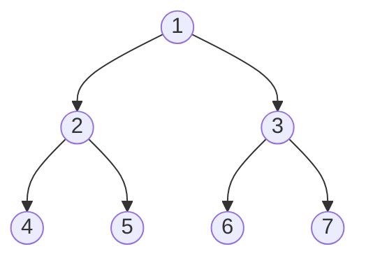
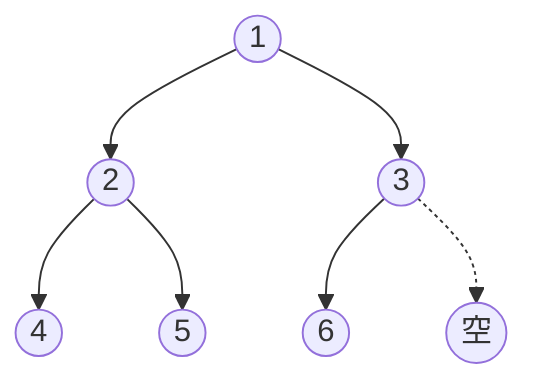
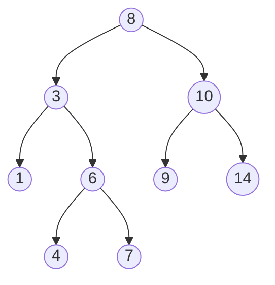
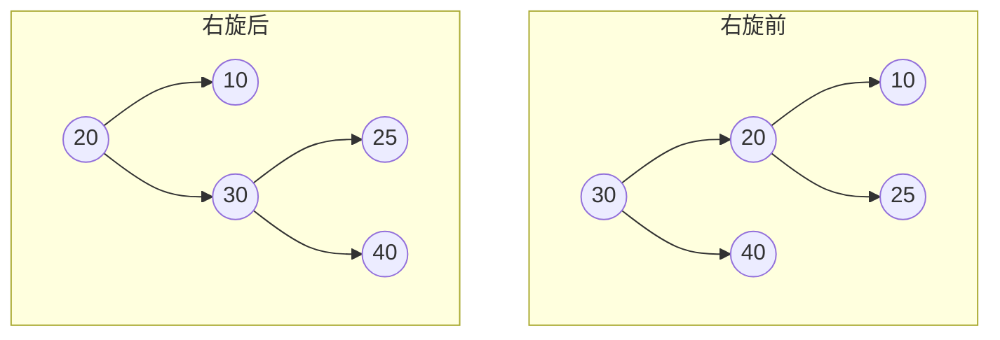
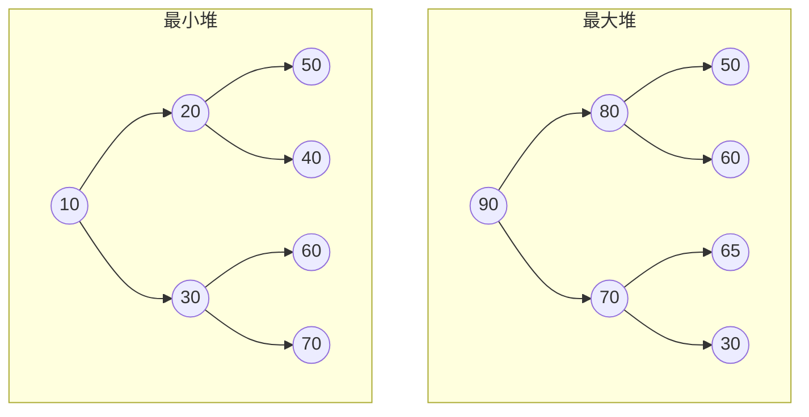
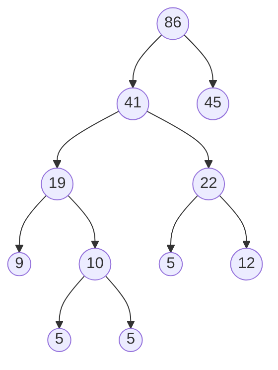
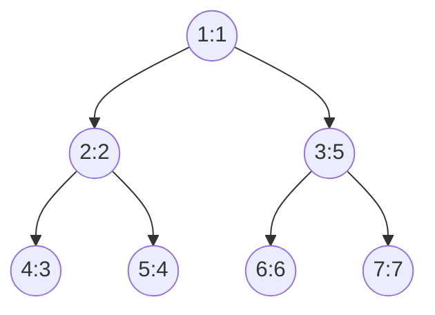
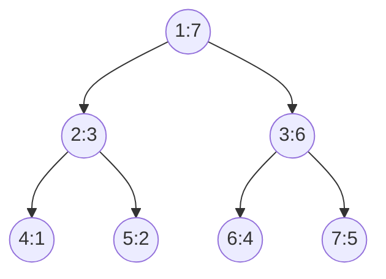
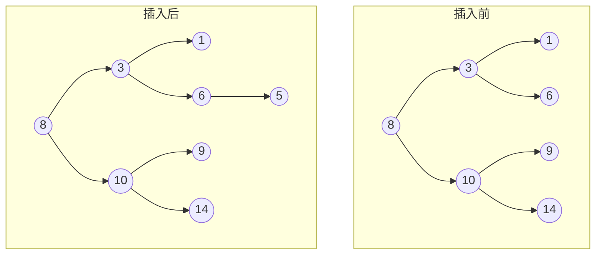
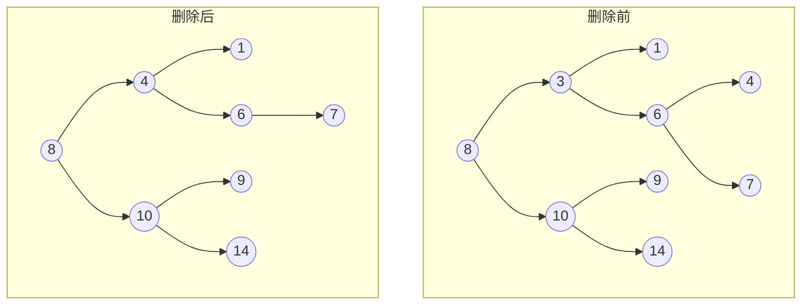

# 二叉树

## 定义与基本概念
二叉树（Binary Tree）是n（n≥0）个节点的有限集合，该集合或者为空集（空二叉树），或者由一个根节点和两棵互不相交的、分别称为根节点的左子树和右子树的二叉树组成。

**特点**：
- 每个节点最多有两个子树（即度不超过2）
- 左子树和右子树有顺序，次序不能任意颠倒
- 即使树中某节点只有一棵子树，也要区分它是左子树还是右子树

## 基本术语
- **节点的度**：节点拥有的子树数
- **树的度**：树中所有节点的度的最大值
- **叶子节点**：度为0的节点（终端节点）
- **分支节点**：度不为0的节点（非终端节点）
- **层/深度**：根为第1层，根的孩子为第2层，以此类推
- **高度**：树中节点的最大层次
- **有序树**：树中节点的各子树从左至右是有次序的
- **森林**：m（m≥0）棵互不相交的树的集合

## 二叉树的性质
1. 在二叉树的第i层上至多有$2^{i-1}$个节点（i≥1）
2. 深度为k的二叉树至多有$2^k-1$个节点（k≥1）
3. 对于任何一棵二叉树T，如果其叶子节点数为$n_0$，度为2的节点数为$n_2$，则$n_0 = n_2 + 1$
4. 具有n个节点的完全二叉树的深度为$\lfloor \log_2 n \rfloor + 1$

## 二叉树的种类
### 满二叉树
深度为k且有$2^k-1$个节点的二叉树。每层都充满节点。


*图：深度为3的满二叉树（节点数 = 2³-1 = 7）*

### 完全二叉树
深度为k、有n个节点的二叉树，当且仅当其每一个节点都与深度为k的满二叉树中编号从1至n的节点一一对应时，称为完全二叉树。

**特点**：
- 叶子节点只可能出现在最下面两层
- 最下层的叶子节点一定集中在左部连续位置
- 倒数第二层若有叶子节点，一定都在右部连续位置
- 如果节点度为1，则该节点只有左孩子
- 同样节点数的二叉树，完全二叉树的深度最小


*图：完全二叉树示例（节点从上到下、从左到右连续排列，最后一层可以不满）*

### 二叉搜索树（BST）
也称为二叉排序树或二叉查找树。具有以下性质：
- 若左子树不空，则左子树上所有节点的值均小于根节点的值
- 若右子树不空，则右子树上所有节点的值均大于根节点的值
- 左、右子树也分别为二叉搜索树

**中序遍历**二叉搜索树可以得到一个有序序列。


*图：二叉搜索树示例（中序遍历：1, 3, 4, 6, 7, 8, 9, 10, 14）*

### 平衡二叉树（AVL树）
一种特殊的二叉搜索树，其中任意节点的两个子树的高度差最大为1。

**平衡因子**：左子树高度 - 右子树高度，取值为-1、0、1。

**旋转操作**：当插入或删除节点导致不平衡时，需要通过旋转来恢复平衡。
- 左旋（LL型）
- 右旋（RR型）
- 左右旋（LR型）
- 右左旋（RL型）

**旋转示例**：

*图：右旋操作（左子树高度 > 右子树高度 + 1）*

### 红黑树
一种自平衡二叉搜索树，每个节点都有颜色（红色或黑色），满足以下性质：
1. 节点是红色或黑色
2. 根节点是黑色
3. 所有叶子节点（NIL）是黑色
4. 每个红色节点必须有两个黑色子节点（不能有两个连续的红色节点）
5. 从任一节点到其每个叶子节点的所有简单路径都包含相同数目的黑色节点

**特点**：统计性能优于AVL树，插入和删除操作效率较高。

### 堆
分为最大堆和最小堆：
- **最大堆**：任意节点的值大于或等于其子节点的值
- **最小堆**：任意节点的值小于或等于其子节点的值


*图：最大堆与最小堆示例*

通常用**数组**实现，父子节点关系：
- 父节点索引：`(i-1)//2`
- 左子节点索引：`2*i + 1`
- 右子节点索引：`2*i + 2`

### 哈夫曼树
带权路径长度（WPL）最小的二叉树，也称为最优二叉树。

**构建过程**（贪心算法）：
1. 将每个权值看作一棵树，构成森林
2. 在森林中选取两棵根节点权值最小的树合并
3. 将新树的根节点权值设为两棵子树根节点权值之和
4. 重复步骤2-3，直到只剩一棵树

**示例**：权值集合{5, 9, 12, 13, 16, 45}构建哈夫曼树

*图：哈夫曼树示例（带权路径长度WPL = 5×3 + 9×2 + 12×2 + 13×2 + 16×2 + 45×1 = 224）*

**应用**：哈夫曼编码（数据压缩）

## 存储结构
### 顺序存储
用数组存储，适用于完全二叉树。
```python
# 完全二叉树的顺序存储
# 对于索引i的节点：
# 父节点：(i-1)//2
# 左子节点：2*i + 1
# 右子节点：2*i + 2

tree = [1, 2, 3, 4, 5, 6, 7]  # 表示一个完全二叉树
```


*图：完全二叉树的顺序存储（数组索引：0→1, 1→2, 2→3, 3→4, 4→5, 5→6, 6→7）*

**缺点**：对于非完全二叉树，会浪费存储空间。

### 链式存储
用链表节点存储，每个节点包含数据域和两个指针域。
```python
class TreeNode:
    def __init__(self, val=0, left=None, right=None):
        self.val = val
        self.left = left
        self.right = right
```

## 二叉树的遍历
以下示例二叉树用于演示各种遍历方式：

*图：示例二叉树*

### 深度优先遍历（DFS）
#### 前序遍历（Preorder）
顺序：**根 → 左 → 右**

前序遍历顺序：1 → 2 → 4 → 5 → 3 → 6 → 7

*图：前序遍历顺序（节点内数字：值:访问顺序）*

**递归实现**：
```python
def preorder_recursive(root):
    if not root:
        return []
    return [root.val] + preorder_recursive(root.left) + preorder_recursive(root.right)
```

**递归执行过程详解**：

以示例二叉树为例，递归调用栈的变化：

```
调用顺序（从上到下是调用，缩进表示层级）：

preorder_recursive(1)              # 访问 1
  preorder_recursive(2)            # 访问 2
    preorder_recursive(4)          # 访问 4
      preorder_recursive(None)     # 返回 []
      preorder_recursive(None)     # 返回 []
      return [4]                   # 4 的左右都为空，返回 [4]
    preorder_recursive(5)          # 访问 5
      preorder_recursive(None)     # 返回 []
      preorder_recursive(None)     # 返回 []
      return [5]                   # 返回 [5]
    return [2] + [4] + [5] = [2,4,5]  # 2 的子树遍历完成
  preorder_recursive(3)            # 访问 3
    preorder_recursive(6)          # 访问 6
      return [6]
    preorder_recursive(7)          # 访问 7
      return [7]
    return [3] + [6] + [7] = [3,6,7]  # 3 的子树遍历完成
  return [1] + [2,4,5] + [3,6,7] = [1,2,4,5,3,6,7]
```

**递归三要素**：
1. **终止条件**：`if not root: return []`（空节点返回空列表）
2. **单层逻辑**：`[root.val] + 左子树结果 + 右子树结果`
3. **返回值**：当前子树的遍历结果列表

**迭代实现**：
```python
def preorder_iterative(root):
    if not root:
        return []
    stack = [root]
    result = []
    while stack:
        node = stack.pop()
        result.append(node.val)
        if node.right:  # 先压右子节点
            stack.append(node.right)
        if node.left:   # 后压左子节点
            stack.append(node.left)
    return result
```

**迭代执行过程详解**：

| 步骤 | 操作 | 栈状态（顶→底） | 结果列表 |
|------|------|----------------|----------|
| 1 | 根节点 1 入栈 | `[1]` | `[]` |
| 2 | 弹出 1，访问 | `[]` | `[1]` |
| 3 | 右子 3 入栈 | `[3]` | `[1]` |
| 4 | 左子 2 入栈 | `[3, 2]` | `[1]` |
| 5 | 弹出 2，访问 | `[3]` | `[1, 2]` |
| 6 | 2 的右子 5 入栈 | `[3, 5]` | `[1, 2]` |
| 7 | 2 的左子 4 入栈 | `[3, 5, 4]` | `[1, 2]` |
| 8 | 弹出 4，访问 | `[3, 5]` | `[1, 2, 4]` |
| 9 | 4 无子节点，弹出 5 | `[3]` | `[1, 2, 4, 5]` |
| 10 | 5 无子节点，弹出 3 | `[]` | `[1, 2, 4, 5, 3]` |
| 11 | 3 的右子 7 入栈 | `[7]` | `[1, 2, 4, 5, 3]` |
| 12 | 3 的左子 6 入栈 | `[7, 6]` | `[1, 2, 4, 5, 3]` |
| 13 | 弹出 6，访问 | `[7]` | `[1, 2, 4, 5, 3, 6]` |
| 14 | 弹出 7，访问 | `[]` | `[1, 2, 4, 5, 3, 6, 7]` |

**关键点**：先压右后压左，保证左子树先被访问（栈是后进先出）

#### 中序遍历（Inorder）
顺序：**左 → 根 → 右**

中序遍历顺序：4 → 2 → 5 → 1 → 6 → 3 → 7

*图：中序遍历顺序（节点内数字：值:访问顺序）*

**递归实现**：
```python
def inorder_recursive(root):
    if not root:
        return []
    return inorder_recursive(root.left) + [root.val] + inorder_recursive(root.right)
```

**递归执行过程详解**：

```
调用顺序（中序遍历：左 → 根 → 右）：

inorder_recursive(1)
  inorder_recursive(2)
    inorder_recursive(4)
      inorder_recursive(None) → return []
      return [] + [4] + [] = [4]           # 4 是叶子，直接返回 [4]
    inorder_recursive(5)
      inorder_recursive(None) → return []
      return [] + [5] + [] = [5]           # 5 是叶子，直接返回 [5]
    return [4] + [2] + [5] = [4,2,5]       # 2 的左子树 [4] + 根 [2] + 右子树 [5]
  inorder_recursive(3)
    inorder_recursive(6) → return [6]
    inorder_recursive(7) → return [7]
    return [6] + [3] + [7] = [6,3,7]
  return [4,2,5] + [1] + [6,3,7] = [4,2,5,1,6,3,7]
```

**关键区别**：根节点值放在左右子树结果的中间！

**迭代实现**：
```python
def inorder_iterative(root):
    result = []
    stack = []
    current = root
    while current or stack:
        while current:
            stack.append(current)
            current = current.left
        current = stack.pop()
        result.append(current.val)
        current = current.right
    return result
```

**迭代执行过程详解**：

| 步骤 | 当前节点 | 操作 | 栈状态（底→顶） | 结果列表 | 说明 |
|------|----------|------|----------------|----------|------|
| 1 | 1 | 一路向左入栈 | `[1]` | `[]` | 1入栈 |
| 2 | 2 | 一路向左入栈 | `[1,2]` | `[]` | 2入栈 |
| 3 | 4 | 一路向左入栈 | `[1,2,4]` | `[]` | 4入栈 |
| 4 | None | 4的左为空，弹出4 | `[1,2]` | `[4]` | 访问4（最左） |
| 5 | None | 4的右为空，弹出2 | `[1]` | `[4,2]` | 访问2（左子树完成） |
| 6 | 5 | 5入栈 | `[1,5]` | `[4,2]` | 转向2的右子树 |
| 7 | None | 5的左为空，弹出5 | `[1]` | `[4,2,5]` | 访问5 |
| 8 | None | 5的右为空，弹出1 | `[]` | `[4,2,5,1]` | 访问1（左子树完成） |
| 9 | 3 | 3入栈 | `[3]` | `[4,2,5,1]` | 转向1的右子树 |
| 10 | 6 | 6入栈 | `[3,6]` | `[4,2,5,1]` | 一路向左 |
| 11 | None | 6的左为空，弹出6 | `[3]` | `[4,2,5,1,6]` | 访问6 |
| 12 | None | 6的右为空，弹出3 | `[]` | `[4,2,5,1,6,3]` | 访问3 |
| 13 | 7 | 7入栈 | `[7]` | `[4,2,5,1,6,3]` | 转向3的右子树 |
| 14 | None | 弹出7 | `[]` | `[4,2,5,1,6,3,7]` | 访问7 |

**核心思想**：
1. 一直向左走，把路径上的节点都入栈（这些节点的左子树还没处理完）
2. 走到尽头后弹出栈顶，此时该节点的左子树已处理完，可以访问该节点
3. 然后转向右子树，重复上述过程

#### 后序遍历（Postorder）
顺序：**左 → 右 → 根**

后序遍历顺序：4 → 5 → 2 → 6 → 7 → 3 → 1

*图：后序遍历顺序（节点内数字：值:访问顺序）*

**递归实现**：
```python
def postorder_recursive(root):
    if not root:
        return []
    return postorder_recursive(root.left) + postorder_recursive(root.right) + [root.val]
```

**递归执行过程详解**：

```
调用顺序（后序遍历：左 → 右 → 根）：

postorder_recursive(1)
  postorder_recursive(2)
    postorder_recursive(4)
      return [] + [] + [4] = [4]           # 4 是叶子，左右为空，返回 [4]
    postorder_recursive(5)
      return [] + [] + [5] = [5]           # 5 是叶子，返回 [5]
    return [4] + [5] + [2] = [4,5,2]       # 2 的左 [4] + 右 [5] + 根 [2]
  postorder_recursive(3)
    postorder_recursive(6) → return [6]
    postorder_recursive(7) → return [7]
    return [6] + [7] + [3] = [6,7,3]
  return [4,5,2] + [6,7,3] + [1] = [4,5,2,6,7,3,1]
```

**关键区别**：根节点值放在最后！必须先完全遍历左右子树才能访问根。

**迭代实现**：
```python
def postorder_iterative(root):
    if not root:
        return []
    stack = [root]
    result = []
    while stack:
        node = stack.pop()
        result.append(node.val)
        if node.left:   # 先压左子节点
            stack.append(node.left)
        if node.right:  # 后压右子节点
            stack.append(node.right)
    return result[::-1]  # 反转结果
```

**迭代执行过程详解**：

**技巧：先实现"根-右-左"，再反转得到"左-右-根"**

| 步骤 | 操作 | 栈状态（顶→底） | 结果（根-右-左） | 说明 |
|------|------|----------------|-----------------|------|
| 1 | 1 入栈 | `[1]` | `[]` | 初始化 |
| 2 | 弹出 1，访问 | `[]` | `[1]` | 访问根 |
| 3 | 左子 2 入栈 | `[2]` | `[1]` | 先压左（注意顺序！） |
| 4 | 右子 3 入栈 | `[2, 3]` | `[1]` | 后压右 |
| 5 | 弹出 3，访问 | `[2]` | `[1, 3]` | 3 在栈顶，先出 |
| 6 | 3 的左子 6 入栈 | `[2, 6]` | `[1, 3]` | |
| 7 | 3 的右子 7 入栈 | `[2, 6, 7]` | `[1, 3]` | |
| 8 | 弹出 7，访问 | `[2, 6]` | `[1, 3, 7]` | |
| 9 | 弹出 6，访问 | `[2]` | `[1, 3, 7, 6]` | |
| 10 | 弹出 2，访问 | `[]` | `[1, 3, 7, 6, 2]` | |
| 11 | 2 的左子 4 入栈 | `[4]` | `[1, 3, 7, 6, 2]` | |
| 12 | 2 的右子 5 入栈 | `[4, 5]` | `[1, 3, 7, 6, 2]` | |
| 13 | 弹出 5，访问 | `[4]` | `[1, 3, 7, 6, 2, 5]` | |
| 14 | 弹出 4，访问 | `[]` | `[1, 3, 7, 6, 2, 5, 4]` | |

**此时结果**：`[1, 3, 7, 6, 2, 5, 4]`（根-右-左顺序）

**反转后**：`[4, 5, 2, 6, 7, 3, 1]`（左-右-根）✓ 后序遍历！

**为什么要反转？**
- 后序遍历要求：左 → 右 → 根
- 但栈的特性让我们容易实现：根 → 右 → 左
- 这两个顺序正好相反，所以反转即可！

### 广度优先遍历（BFS）
#### 层序遍历（Level Order）
逐层从左到右访问节点。

层序遍历顺序：1 → 2 → 3 → 4 → 5 → 6 → 7

*图：层序遍历顺序（节点内数字：值:访问顺序）*

**实现**：
```python
from collections import deque

def level_order(root):
    if not root:
        return []
    queue = deque([root])
    result = []
    while queue:
        level_size = len(queue)
        current_level = []
        for _ in range(level_size):
            node = queue.popleft()
            current_level.append(node.val)
            if node.left:
                queue.append(node.left)
            if node.right:
                queue.append(node.right)
        result.append(current_level)
    return result
```

**执行过程详解**：

**核心思想**：使用队列（FIFO），保证先访问的节点的子节点也先被访问

| 步骤 | 操作 | 队列（头→尾） | 当前层结果 | 说明 |
|------|------|--------------|-----------|------|
| 1 | 1 入队 | `[1]` | - | 初始化，根入队 |
| **第1层处理** | level_size = 1 | | | |
| 2 | 1 出队，访问 | `[]` | `[1]` | 第1层：访问 1 |
| 3 | 1 的左子 2 入队 | `[2]` | `[1]` | 2 是第2层 |
| 4 | 1 的右子 3 入队 | `[2, 3]` | `[1]` | 3 是第2层 |
| | result = `[[1]]` | | | 第1层完成 |
| **第2层处理** | level_size = 2 | | | |
| 5 | 2 出队，访问 | `[3]` | `[2]` | 第2层开始 |
| 6 | 2 的左子 4 入队 | `[3, 4]` | `[2]` | 4 是第3层 |
| 7 | 2 的右子 5 入队 | `[3, 4, 5]` | `[2]` | 5 是第3层 |
| 8 | 3 出队，访问 | `[4, 5]` | `[2, 3]` | 第2层继续 |
| 9 | 3 的左子 6 入队 | `[4, 5, 6]` | `[2, 3]` | 6 是第3层 |
| 10 | 3 的右子 7 入队 | `[4, 5, 6, 7]` | `[2, 3]` | 7 是第3层 |
| | result = `[[1], [2, 3]]` | | | 第2层完成 |
| **第3层处理** | level_size = 4 | | | |
| 11 | 4 出队，访问 | `[5, 6, 7]` | `[4]` | 第3层开始 |
| 12 | 4 无子节点 | `[5, 6, 7]` | `[4]` | |
| 13 | 5 出队，访问 | `[6, 7]` | `[4, 5]` | |
| 14 | 5 无子节点 | `[6, 7]` | `[4, 5]` | |
| 15 | 6 出队，访问 | `[7]` | `[4, 5, 6]` | |
| 16 | 6 无子节点 | `[7]` | `[4, 5, 6]` | |
| 17 | 7 出队，访问 | `[]` | `[4, 5, 6, 7]` | 第3层结束 |
| | result = `[[1], [2, 3], [4, 5, 6, 7]]` | | | 遍历完成 |

**关键点解析**：

1. **为什么要用队列而不是栈？**
   - 栈是 LIFO（后进先出），适合深度优先
   - 队列是 FIFO（先进先出），适合按层遍历
   - 先访问的节点的子节点要先入队，才能保证按层顺序

2. **level_size 的作用**
   - 记录当前层的节点数
   - 保证每次只处理一层的节点
   - 处理完当前层后，队列里正好是所有下一层的节点

3. **为什么结果要分层存储？**
   - `[[1], [2, 3], [4, 5, 6, 7]]` 比 `[1, 2, 3, 4, 5, 6, 7]` 更有用
   - 可以知道每层有哪些节点
   - 方便求树的高度、判断完全二叉树等

**层序遍历的应用**：
- 求二叉树的最大/最小深度
- 判断完全二叉树
- 按层打印二叉树
- 求每一层的最大值/平均值（LeetCode 515, 637）

## 常见操作与算法
### 求二叉树的深度
```python
def max_depth(root):
    if not root:
        return 0
    left_depth = max_depth(root.left)
    right_depth = max_depth(root.right)
    return max(left_depth, right_depth) + 1
```

### 求二叉树的节点数
```python
def count_nodes(root):
    if not root:
        return 0
    return 1 + count_nodes(root.left) + count_nodes(root.right)
```

### 求叶子节点数
```python
def count_leaves(root):
    if not root:
        return 0
    if not root.left and not root.right:
        return 1
    return count_leaves(root.left) + count_leaves(root.right)
```

### 翻转二叉树
```python
def invert_tree(root):
    if not root:
        return None
    root.left, root.right = invert_tree(root.right), invert_tree(root.left)
    return root
```

### 判断对称二叉树
```python
def is_symmetric(root):
    """
    递归法
    """
    if not root: 
        return True
    def compare(left, right): 
        if not left and not right: 
            return True
        if no left or not right: 
            return False
        if left.val != right.val: 
            return False
        outside = compare(left.left, right.right)
        inside = compare(left.right, right. left)
        return outside and inside
    return compare(root.left, root.right)
def is_symmetric1(root):
    """ 
    迭代法
    """
    if not root: 
        return True
    stack = [root.left, root.right]
    while stack: 
        left = stack.pop(0)
        right = stack.pop(0)
        if left.val != right.val: 
            return False
        if not left and not right: 
            continue
        if not left or not right: 
            return False
        stack.append(left.left)
        stack.append(right.left)
        stack.append(left.right)
        stack.append(right.left)
    return True
```

### 求二叉树的最近公共祖先（LCA）
```python
def lowest_common_ancestor(root, p, q):
    """
    递归法求LCA
    """
    if not root or root == p or root == q: 
        return root
    left = lowest_common_ancestor(root.left, p, q)
    right = lowest_common_ancestor(root.right, p, q)
    if left and right: 
        return root 
    return left or right

def lowest_common_ancestor1(root, p, q):
    """ 
    迭代法求LCA
    """ 
    parent = {root: None}
    stack = [root]
    while p not in parent or q not in parent: 
        node = stack.pop()
        if node.left: 
            parent[node.left] = node
            stack.append(node.left)
        if node.right: 
            parent[node.right] = node
            stack.append(node.right)
    ancestors = set()
    while p: 
        ancestors.add(p)
        p = parent[p]
    while q not in ancestors: 
        q = parent[q]
    return q
```

### 二叉树的序列化与反序列化
```python
class Codec:
    def serialize(self, root):
        if not root:
            return "None"
        return str(root.val) + "," + self.serialize(root.left) + "," + self.serialize(root.right)
    
    def deserialize(self, data):
        def build_tree(nodes):
            val = next(nodes)
            if val == "None":
                return None
            node = TreeNode(int(val))
            node.left = build_tree(nodes)
            node.right = build_tree(nodes)
            return node
        
        nodes = iter(data.split(","))
        return build_tree(nodes)
```

## 二叉搜索树的操作
### 查找
```python
def search_bst(root, val):
    if not root or root.val == val:
        return root
    if val < root.val:
        return search_bst(root.left, val)
    return search_bst(root.right, val)
```

### 插入
```python
def insert_into_bst(root, val):
    if not root:
        return TreeNode(val)
    if val < root.val:
        root.left = insert_into_bst(root.left, val)
    else:
        root.right = insert_into_bst(root.right, val)
    return root
```

插入示例：在BST中插入节点5

*图：在BST中插入节点5（从根开始比较，找到合适位置）*

### 删除
```python
def delete_node_successor(root, key):
    if not root: 
        return None 
    if root.val > key: 
        root.left = delete_node_successor(root.left, key)
    elif root.val < key: 
        root.right = delete_node_successor(root.right, key)
    else: 
        if not root.left and not root.right: 
            return None 
        if not root.left: 
            return root.right
        if not root.right: 
            return root.left 
        successor = root.right
        while successor.left: 
            successor = successor.left
        root.val = successor.val
        root.right = delete_node_successor(root.right, successor.val)
def delete_node_predcessor(root, key): 
    if not root: 
        return None
    if root.val > key: 
        root.left = delete_node_predcessor(root.left, key)
    elif root.val < key: 
        root.right = delete_node_predcessor(root.left, key)
    else: 
        if not root.left and not root.right: 
            return None 
        if not root.left: 
            return root.right
        if not root.right: 
            return root.left
        predcessor = root.left
        while predcessor.right: 
            predcessor = predcessor.right
        root.val = predcesspr.val
        root.left = delete_node_predcessor(root.left, predcessor.val)
def delete_node_iter(root, key): 
    if not root: 
        return None
    parent = None 
    current = root
    while current and current.val != key: 
        parent = current
        if key < current.val: 
            current = current.left
        else:
            current = current.right
    if not current: 
        return root
    target = current
    if target.left and target.right: 
        successor = target.right
        successor_parent = target
        while successor.left: 
            successor_parent = successor
            successor = successor.left
        target.val = successor.val
        target = successor
        parent = successor_parent
    child = target.left if target.left else target.right
    if parent is None: 
        root = child
    elif parent.left is target: 
        parent.left = child
    else: 
        parent.right = child
    return root
```

删除示例：删除节点3（有两个子节点）

*图：删除节点3（用后继节点4替换，然后删除原后继节点）*

### 验证二叉搜索树
```python
def is_valid_bst(root, left=float('-inf'), right=float('inf')):
    if not root:
        return True
    if not (left < root.val < right):
        return False
    return (is_valid_bst(root.left, left, root.val) and 
            is_valid_bst(root.right, root.val, right))
```

## 应用场景
1. **文件系统**：目录结构通常用树表示
2. **数据库索引**：B树、B+树用于数据库索引
3. **表达式树**：表示算术表达式，便于求值
4. **哈夫曼编码**：数据压缩
5. **决策树**：机器学习中的分类算法
6. **堆排序**：使用堆结构进行排序
7. **优先队列**：使用堆实现
8. **二叉搜索树**：高效查找、插入、删除操作

## 练习题
1. 实现二叉树的前序、中序、后序遍历（递归和迭代）
2. 实现二叉树的层序遍历
3. 求二叉树的最大深度
4. 翻转二叉树
5. 验证二叉搜索树
6. 求二叉树的最近公共祖先
7. 实现二叉搜索树的插入、删除、查找
8. 将有序数组转换为二叉搜索树
9. 求二叉树的直径（任意两个节点之间的最长路径）
10. 判断二叉树是否平衡