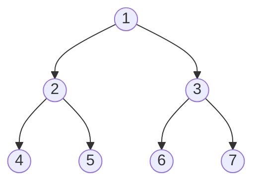
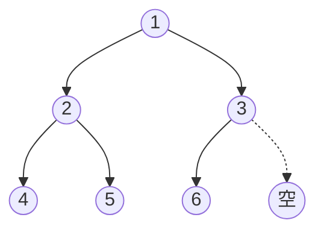
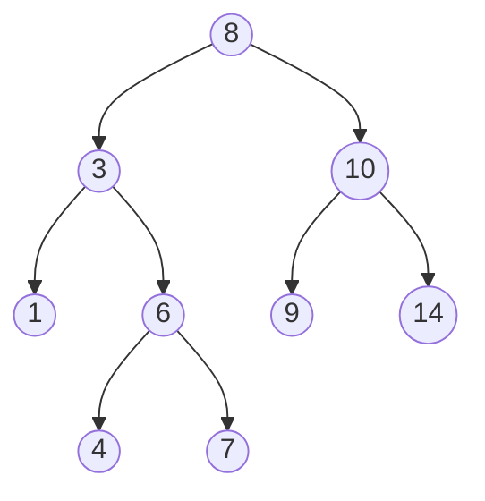
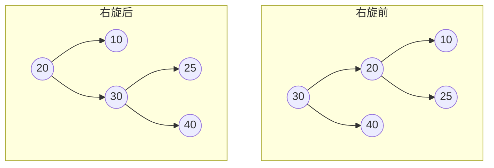
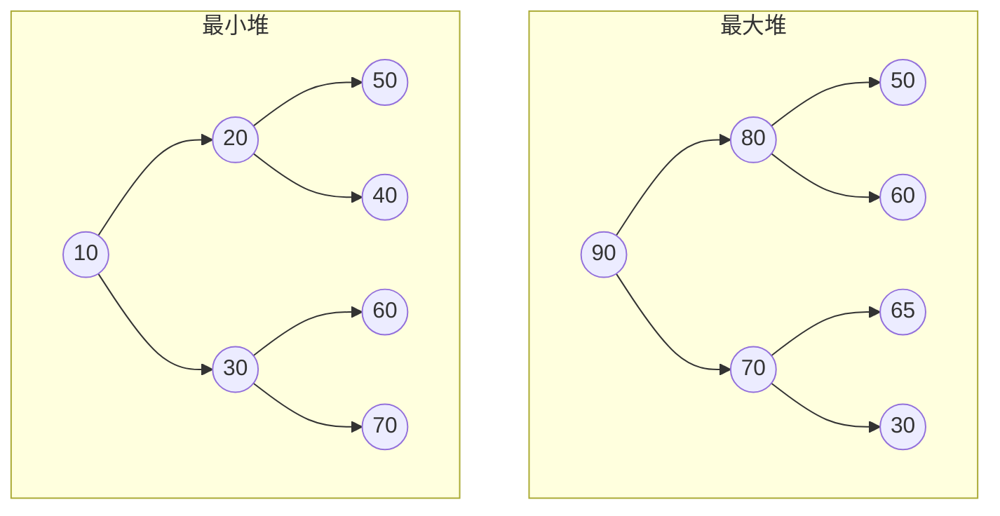
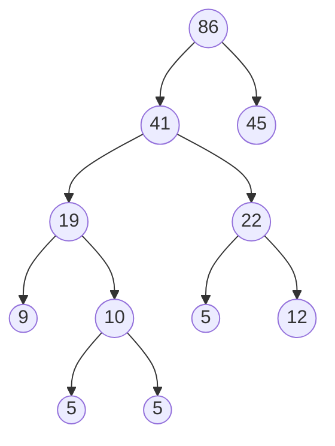
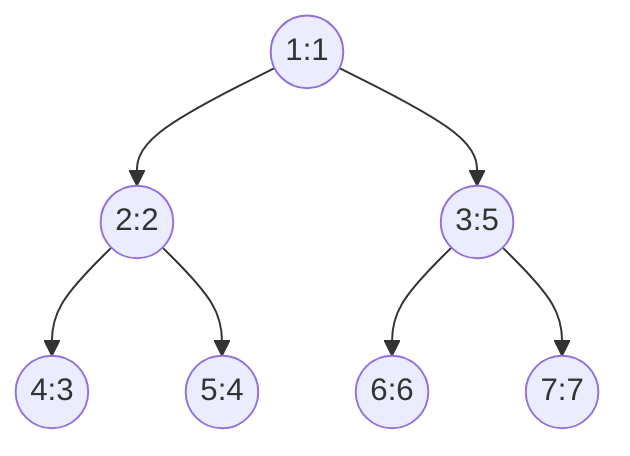
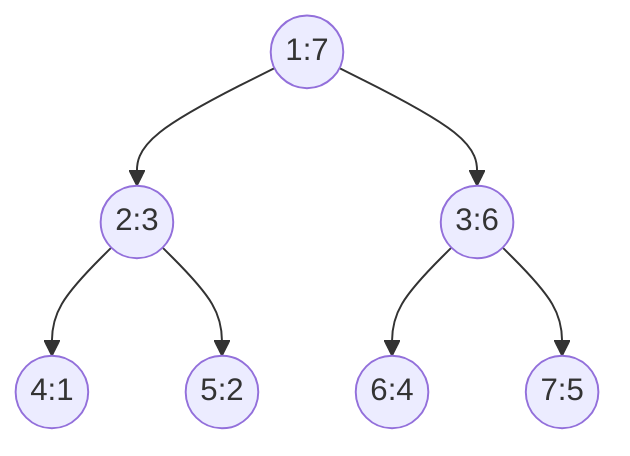
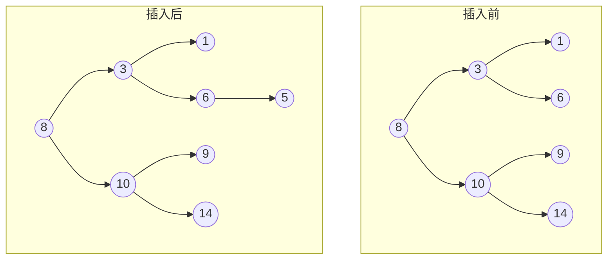
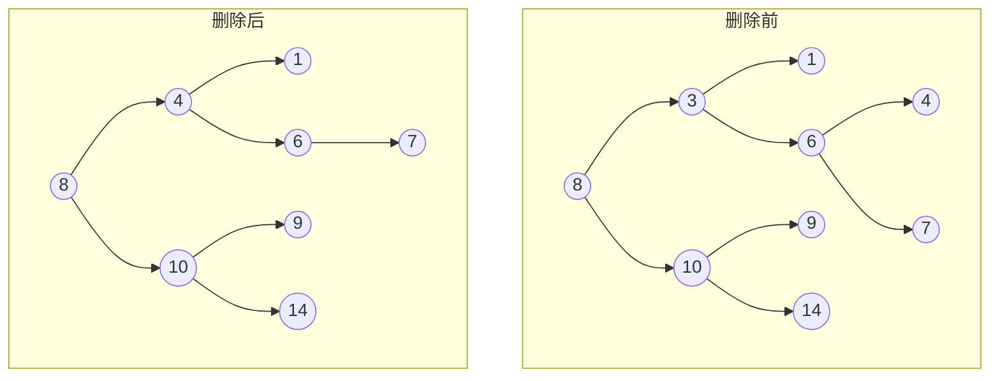

# 二叉树

## 定义与基本概念
二叉树（Binary Tree）是n（n≥0）个节点的有限集合，该集合或者为空集（空二叉树），或者由一个根节点和两棵互不相交的、分别称为根节点的左子树和右子树的二叉树组成。

**特点**：
- 每个节点最多有两个子树（即度不超过2）
- 左子树和右子树有顺序，次序不能任意颠倒
- 即使树中某节点只有一棵子树，也要区分它是左子树还是右子树

## 基本术语
- **节点的度**：节点拥有的子树数
- **树的度**：树中所有节点的度的最大值
- **叶子节点**：度为0的节点（终端节点）
- **分支节点**：度不为0的节点（非终端节点）
- **层/深度**：根为第1层，根的孩子为第2层，以此类推
- **高度**：树中节点的最大层次
- **有序树**：树中节点的各子树从左至右是有次序的
- **森林**：m（m≥0）棵互不相交的树的集合

## 二叉树的性质
1. 在二叉树的第i层上至多有$2^{i-1}$个节点（i≥1）
2. 深度为k的二叉树至多有$2^k-1$个节点（k≥1）
3. 对于任何一棵二叉树T，如果其叶子节点数为$n_0$，度为2的节点数为$n_2$，则$n_0 = n_2 + 1$
4. 具有n个节点的完全二叉树的深度为$\lfloor \log_2 n \rfloor + 1$

## 二叉树的种类
### 满二叉树
深度为k且有$2^k-1$个节点的二叉树。每层都充满节点。


*图：深度为3的满二叉树（节点数 = 2³-1 = 7）*

### 完全二叉树
深度为k、有n个节点的二叉树，当且仅当其每一个节点都与深度为k的满二叉树中编号从1至n的节点一一对应时，称为完全二叉树。

**特点**：
- 叶子节点只可能出现在最下面两层
- 最下层的叶子节点一定集中在左部连续位置
- 倒数第二层若有叶子节点，一定都在右部连续位置
- 如果节点度为1，则该节点只有左孩子
- 同样节点数的二叉树，完全二叉树的深度最小


*图：完全二叉树示例（节点从上到下、从左到右连续排列，最后一层可以不满）*

### 二叉搜索树（BST）
也称为二叉排序树或二叉查找树。具有以下性质：
- 若左子树不空，则左子树上所有节点的值均小于根节点的值
- 若右子树不空，则右子树上所有节点的值均大于根节点的值
- 左、右子树也分别为二叉搜索树

**中序遍历**二叉搜索树可以得到一个有序序列。


*图：二叉搜索树示例（中序遍历：1, 3, 4, 6, 7, 8, 9, 10, 14）*

### 平衡二叉树（AVL树）
一种特殊的二叉搜索树，其中任意节点的两个子树的高度差最大为1。

**平衡因子**：左子树高度 - 右子树高度，取值为-1、0、1。

**旋转操作**：当插入或删除节点导致不平衡时，需要通过旋转来恢复平衡。
- 左旋（LL型）
- 右旋（RR型）
- 左右旋（LR型）
- 右左旋（RL型）

**旋转示例**：

*图：右旋操作（左子树高度 > 右子树高度 + 1）*

### 红黑树
一种自平衡二叉搜索树，每个节点都有颜色（红色或黑色），满足以下性质：
1. 节点是红色或黑色
2. 根节点是黑色
3. 所有叶子节点（NIL）是黑色
4. 每个红色节点必须有两个黑色子节点（不能有两个连续的红色节点）
5. 从任一节点到其每个叶子节点的所有简单路径都包含相同数目的黑色节点

**特点**：统计性能优于AVL树，插入和删除操作效率较高。

### 堆
分为最大堆和最小堆：
- **最大堆**：任意节点的值大于或等于其子节点的值
- **最小堆**：任意节点的值小于或等于其子节点的值


*图：最大堆与最小堆示例*

通常用**数组**实现，父子节点关系：
- 父节点索引：`(i-1)//2`
- 左子节点索引：`2*i + 1`
- 右子节点索引：`2*i + 2`

### 哈夫曼树
带权路径长度（WPL）最小的二叉树，也称为最优二叉树。

**构建过程**（贪心算法）：
1. 将每个权值看作一棵树，构成森林
2. 在森林中选取两棵根节点权值最小的树合并
3. 将新树的根节点权值设为两棵子树根节点权值之和
4. 重复步骤2-3，直到只剩一棵树

**示例**：权值集合{5, 9, 12, 13, 16, 45}构建哈夫曼树

*图：哈夫曼树示例（带权路径长度WPL = 5×3 + 9×2 + 12×2 + 13×2 + 16×2 + 45×1 = 224）*

**应用**：哈夫曼编码（数据压缩）

## 存储结构
### 顺序存储
用数组存储，适用于完全二叉树。
```python
# 完全二叉树的顺序存储
# 对于索引i的节点：
# 父节点：(i-1)//2
# 左子节点：2*i + 1
# 右子节点：2*i + 2

tree = [1, 2, 3, 4, 5, 6, 7]  # 表示一个完全二叉树
```


*图：完全二叉树的顺序存储（数组索引：0→1, 1→2, 2→3, 3→4, 4→5, 5→6, 6→7）*

**缺点**：对于非完全二叉树，会浪费存储空间。

### 链式存储
用链表节点存储，每个节点包含数据域和两个指针域。
```python
class TreeNode:
    def __init__(self, val=0, left=None, right=None):
        self.val = val
        self.left = left
        self.right = right
```

## 二叉树的遍历
以下示例二叉树用于演示各种遍历方式：

*图：示例二叉树*

### 深度优先遍历（DFS）
#### 前序遍历（Preorder）
顺序：**根 → 左 → 右**

前序遍历顺序：1 → 2 → 4 → 5 → 3 → 6 → 7

*图：前序遍历顺序（节点内数字：值:访问顺序）*

**递归实现**：
```python
def preorder_recursive(root):
    if not root:
        return []
    return [root.val] + preorder_recursive(root.left) + preorder_recursive(root.right)
```

**迭代实现**：
```python
def preorder_iterative(root):
    if not root:
        return []
    stack = [root]
    result = []
    while stack:
        node = stack.pop()
        result.append(node.val)
        if node.right:  # 先压右子节点
            stack.append(node.right)
        if node.left:   # 后压左子节点
            stack.append(node.left)
    return result
```

#### 中序遍历（Inorder）
顺序：**左 → 根 → 右**

中序遍历顺序：4 → 2 → 5 → 1 → 6 → 3 → 7

*图：中序遍历顺序（节点内数字：值:访问顺序）*

**递归实现**：
```python
def inorder_recursive(root):
    if not root:
        return []
    return inorder_recursive(root.left) + [root.val] + inorder_recursive(root.right)
```

**迭代实现**：
```python
def inorder_iterative(root):
    result = []
    stack = []
    current = root
    while current or stack:
        while current:
            stack.append(current)
            current = current.left
        current = stack.pop()
        result.append(current.val)
        current = current.right
    return result
```

#### 后序遍历（Postorder）
顺序：**左 → 右 → 根**

后序遍历顺序：4 → 5 → 2 → 6 → 7 → 3 → 1

*图：后序遍历顺序（节点内数字：值:访问顺序）*

**递归实现**：
```python
def postorder_recursive(root):
    if not root:
        return []
    return postorder_recursive(root.left) + postorder_recursive(root.right) + [root.val]
```

**迭代实现**：
```python
def postorder_iterative(root):
    if not root:
        return []
    stack = [root]
    result = []
    while stack:
        node = stack.pop()
        result.append(node.val)
        if node.left:   # 先压左子节点
            stack.append(node.left)
        if node.right:  # 后压右子节点
            stack.append(node.right)
    return result[::-1]  # 反转结果
```

### 广度优先遍历（BFS）
#### 层序遍历（Level Order）
逐层从左到右访问节点。

层序遍历顺序：1 → 2 → 3 → 4 → 5 → 6 → 7

*图：层序遍历顺序（节点内数字：值:访问顺序）*

**实现**：
```python
from collections import deque

def level_order(root):
    if not root:
        return []
    queue = deque([root])
    result = []
    while queue:
        level_size = len(queue)
        current_level = []
        for _ in range(level_size):
            node = queue.popleft()
            current_level.append(node.val)
            if node.left:
                queue.append(node.left)
            if node.right:
                queue.append(node.right)
        result.append(current_level)
    return result
```

## 常见操作与算法
### 求二叉树的深度
```python
def max_depth(root):
    if not root:
        return 0
    left_depth = max_depth(root.left)
    right_depth = max_depth(root.right)
    return max(left_depth, right_depth) + 1
```

### 求二叉树的节点数
```python
def count_nodes(root):
    if not root:
        return 0
    return 1 + count_nodes(root.left) + count_nodes(root.right)
```

### 求叶子节点数
```python
def count_leaves(root):
    if not root:
        return 0
    if not root.left and not root.right:
        return 1
    return count_leaves(root.left) + count_leaves(root.right)
```

### 翻转二叉树
```python
def invert_tree(root):
    if not root:
        return None
    root.left, root.right = invert_tree(root.right), invert_tree(root.left)
    return root
```

### 判断对称二叉树
```python
def is_symmetric(root):
    def is_mirror(t1, t2):
        if not t1 and not t2:
            return True
        if not t1 or not t2:
            return False
        return (t1.val == t2.val and 
                is_mirror(t1.left, t2.right) and 
                is_mirror(t1.right, t2.left))
    return is_mirror(root, root) if root else True
```

### 求二叉树的最近公共祖先（LCA）
```python
def lowest_common_ancestor(root, p, q):
    if not root or root == p or root == q:
        return root
    left = lowest_common_ancestor(root.left, p, q)
    right = lowest_common_ancestor(root.right, p, q)
    if left and right:
        return root
    return left if left else right
```

### 二叉树的序列化与反序列化
```python
class Codec:
    def serialize(self, root):
        if not root:
            return "None"
        return str(root.val) + "," + self.serialize(root.left) + "," + self.serialize(root.right)
    
    def deserialize(self, data):
        def build_tree(nodes):
            val = next(nodes)
            if val == "None":
                return None
            node = TreeNode(int(val))
            node.left = build_tree(nodes)
            node.right = build_tree(nodes)
            return node
        
        nodes = iter(data.split(","))
        return build_tree(nodes)
```

## 二叉搜索树的操作
### 查找
```python
def search_bst(root, val):
    if not root or root.val == val:
        return root
    if val < root.val:
        return search_bst(root.left, val)
    return search_bst(root.right, val)
```

### 插入
```python
def insert_into_bst(root, val):
    if not root:
        return TreeNode(val)
    if val < root.val:
        root.left = insert_into_bst(root.left, val)
    else:
        root.right = insert_into_bst(root.right, val)
    return root
```

插入示例：在BST中插入节点5

*图：在BST中插入节点5（从根开始比较，找到合适位置）*

### 删除
```python
def delete_node(root, key):
    if not root:
        return None
    if key < root.val:
        root.left = delete_node(root.left, key)
    elif key > root.val:
        root.right = delete_node(root.right, key)
    else:
        if not root.left:
            return root.right
        if not root.right:
            return root.left
        # 找到右子树的最小节点
        min_node = root.right
        while min_node.left:
            min_node = min_node.left
        root.val = min_node.val
        root.right = delete_node(root.right, min_node.val)
    return root
```

删除示例：删除节点3（有两个子节点）

*图：删除节点3（用后继节点4替换，然后删除原后继节点）*

### 验证二叉搜索树
```python
def is_valid_bst(root, left=float('-inf'), right=float('inf')):
    if not root:
        return True
    if not (left < root.val < right):
        return False
    return (is_valid_bst(root.left, left, root.val) and 
            is_valid_bst(root.right, root.val, right))
```

## 应用场景
1. **文件系统**：目录结构通常用树表示
2. **数据库索引**：B树、B+树用于数据库索引
3. **表达式树**：表示算术表达式，便于求值
4. **哈夫曼编码**：数据压缩
5. **决策树**：机器学习中的分类算法
6. **堆排序**：使用堆结构进行排序
7. **优先队列**：使用堆实现
8. **二叉搜索树**：高效查找、插入、删除操作

## 练习题
1. 实现二叉树的前序、中序、后序遍历（递归和迭代）
2. 实现二叉树的层序遍历
3. 求二叉树的最大深度
4. 翻转二叉树
5. 验证二叉搜索树
6. 求二叉树的最近公共祖先
7. 实现二叉搜索树的插入、删除、查找
8. 将有序数组转换为二叉搜索树
9. 求二叉树的直径（任意两个节点之间的最长路径）
10. 判断二叉树是否平衡